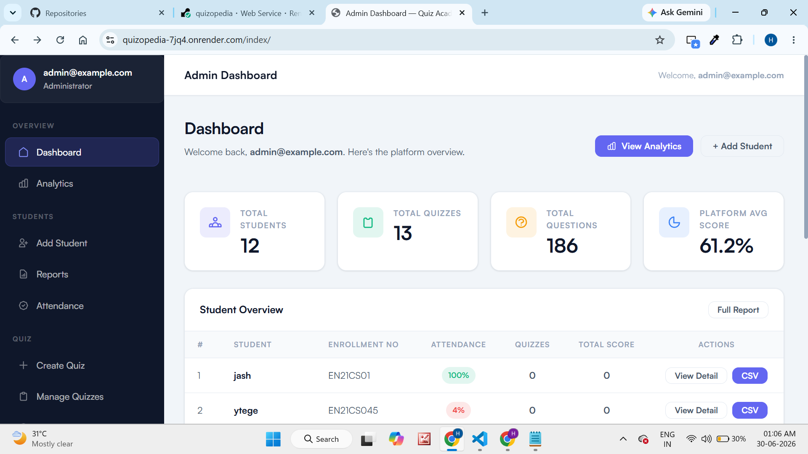
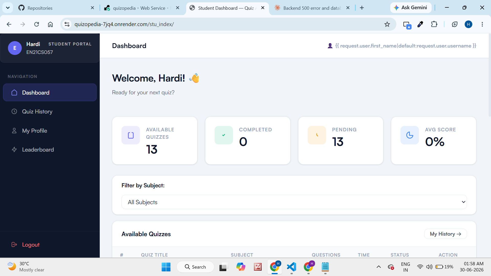
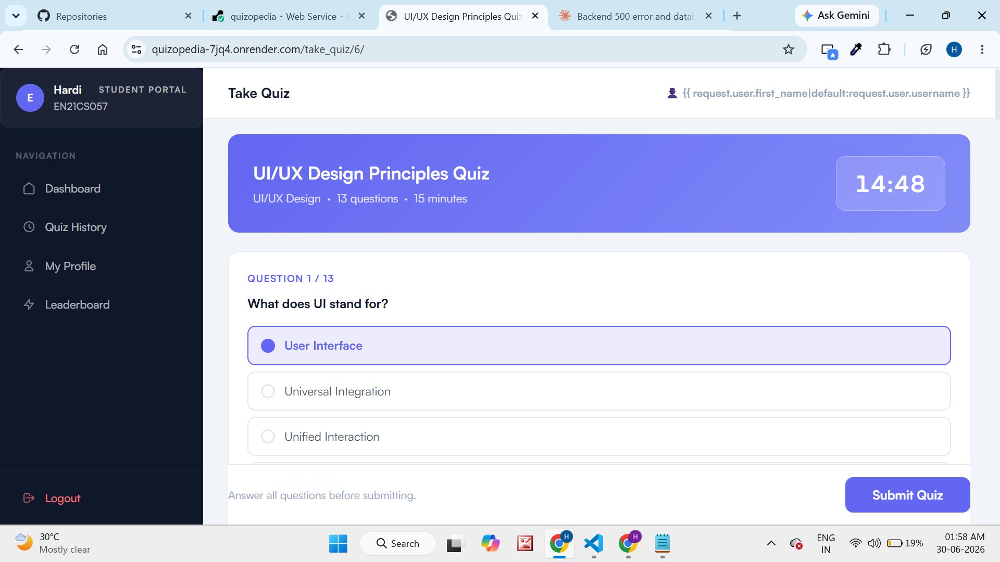
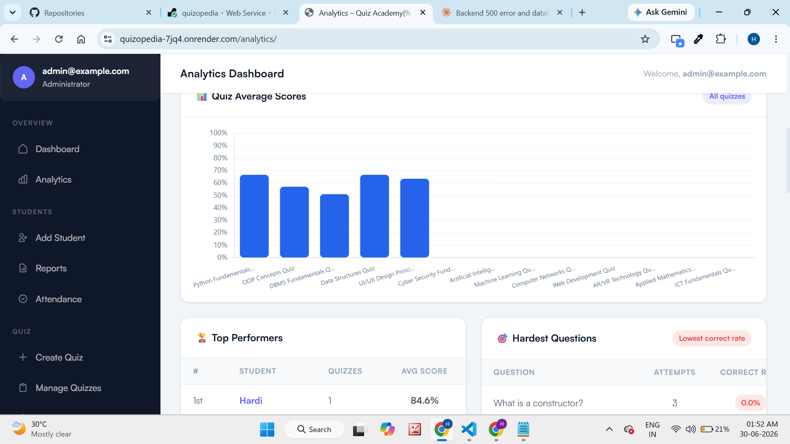
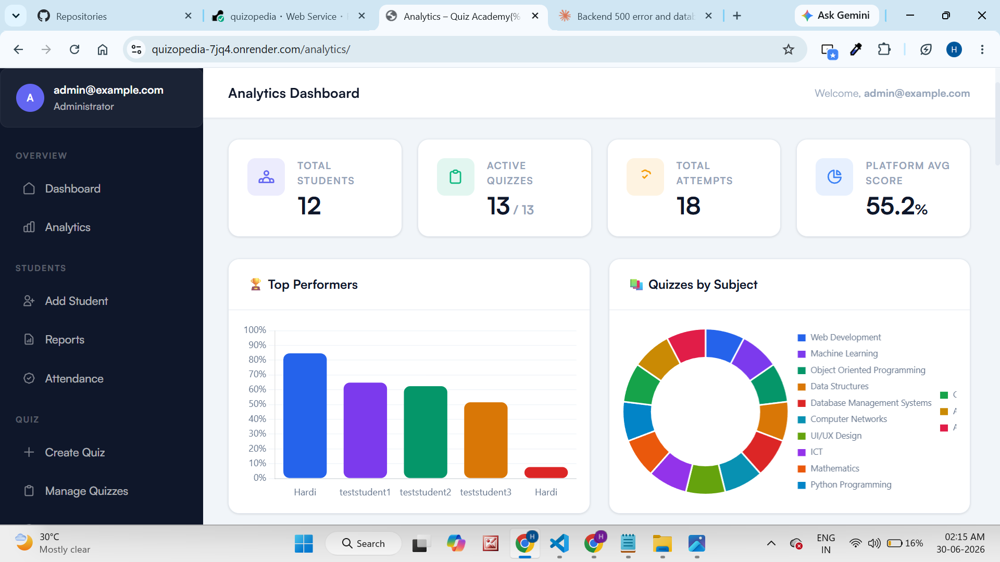
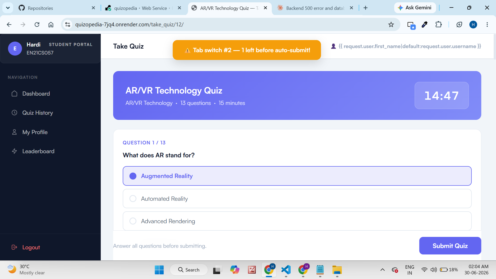
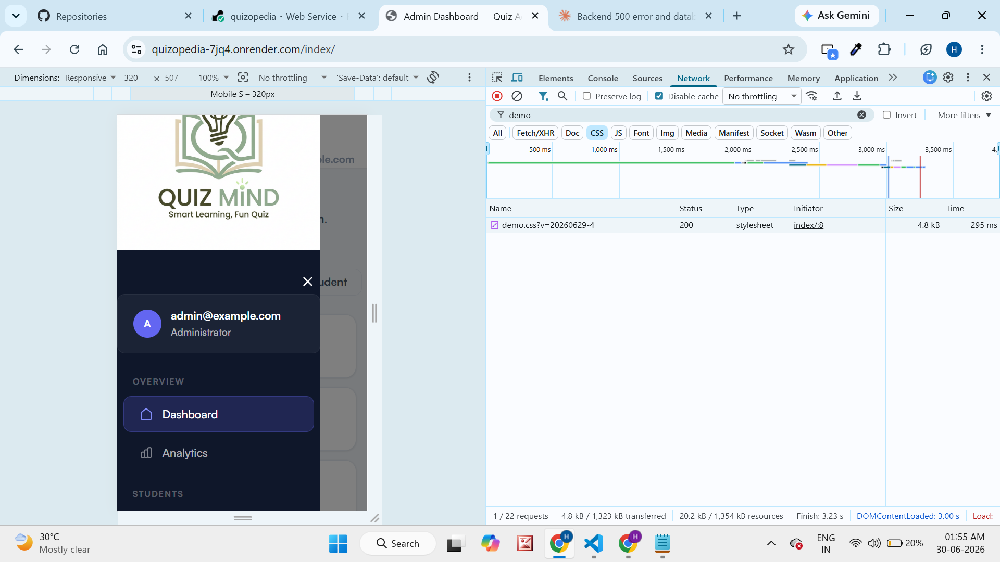

# Quizopedia — Online Quiz Management System

A full-stack quiz management platform built for colleges and institutions — handling quiz creation, student management, real-time analytics, and automated certificate generation across two distinct user roles.

**Live demo:** https://quizopedia-7jq4.onrender.com
**Backend:** Django + PostgreSQL on Render + Supabase

> Demo credentials available on request. Admin login at `/admin_login/`, Student login at `/login/`

---

## Screenshots









---

## Overview

Quizopedia models a real institution's quiz workflow with **two role-based dashboards**, each scoped to exactly what that role needs:

| Role | Capabilities |
|---|---|
| **Admin** | Manage students (add individually or bulk CSV import), create and manage quizzes, add questions and options, view analytics, track attendance, view leaderboard |
| **Student** | Browse available quizzes by subject, take timed quizzes, view results and history, earn certificates on passing, view leaderboard and profile |

The full lifecycle is connected end-to-end:
**Admin creates quiz → Admin adds questions → Student takes quiz → Auto-graded → Certificate generated if passed → Analytics updated.**

---

## Tech Stack

**Frontend**
- Django Templates (HTML, CSS, JavaScript)
- Custom CSS Design System (Satoshi font, indigo color palette)
- Chart.js (analytics charts)
- Responsive layout with mobile sidebar drawer

**Backend**
- Python (Django framework)
- Custom authentication with role-based access control
- Django ORM for database queries
- Deployed on **Render**

**Database**
- PostgreSQL via **Supabase** (Transaction Pooler connection)

---

## Key Features

**Admin**
- Add students individually with full profile (CGPA, branch, proctor, attendance)
- Bulk import students via CSV upload
- Create quizzes with subject categories, time limits, and pass marks
- Add multiple-choice questions with options and correct answer marking
- Toggle quizzes active/inactive
- View per-student analytics, category-wise reports, and platform-wide stats
- Track attendance and download PDF performance reports

**Student**
- Filter available quizzes by subject
- Timed quiz with auto-submit on timer expiry
- **Auto-submit on tab switch** — quiz submits automatically if the student switches tabs or windows more than 3 times (anti-cheating)
- Instant result with score, percentage, grade, and answer review
- Certificate generation for scores ≥ 40%
- Quiz history and leaderboard

---

## Architecture Notes

- **Role-based access** enforced at the view level — every Django view checks `user.user_type` independently, not just at login
- **Custom authentication backend** — login uses email instead of Django's default username
- **Auto-grading** — quiz submission triggers server-side scoring, percentage calculation, grade assignment, and certificate creation in a single transaction
- **Anti-cheating** — JavaScript tab visibility API detects focus loss; after 3 switches the quiz auto-submits with whatever answers were given
- **Bulk import** — CSV upload with row-level error handling; partial imports succeed even if some rows fail

---

## Running Locally

```bash
cd QuizWithAdmin-master
pip install -r requirements.txt
python manage.py migrate
python manage.py createsuperuser
python manage.py runserver
```

Requires a `.env` with `DATABASE_URL` (Supabase pooler connection string) for production. Local development uses SQLite by default.

To seed quiz data:
```bash
python seed_db.py
python populate_db.py
```

---

## A Note on Process

This project was built with significant assistance from Claude (Anthropic), used as a pair-programming and debugging partner — from initial feature builds through database migration, production deployment debugging, and UI polish. The architecture decisions, feature scope, and implementation choices were directed and reviewed throughout the build.

---

## License

Personal/portfolio project.
